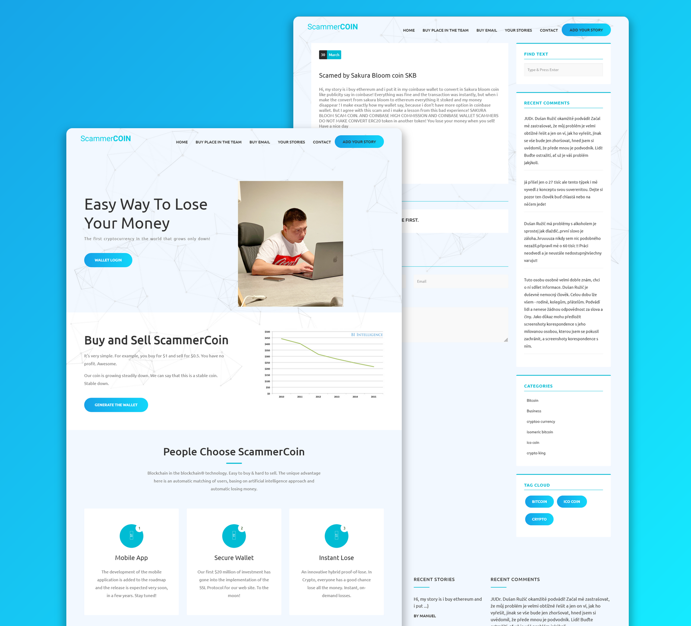

# Swenlii's scammercoin

💶 сайт криптовалюты, растущей только вниз 😁

 

> ⚠️ **ВНИМАНИЕ!** ⚠️ Не скачивайте проект. Только для чтения. 

## ⚡Описание проекта

**Год разработки**: 2019 год

**Стек**: ● Vue.js ● ejs ● HTML ● CSS ● JQuery ● Bootstrap ● Axios ● Node.js ● Express

Сайт создан исключительно ради опыта и шутки. Сайт преследует одну цель - правду. Многие сайты, посвященные криптовалюте, обещают, что именно с ними вы точно разбогатеете. Но каким сайтам верить, а каким нет? Кто реально продаст криптовалюту, а кто заберёт ваши деньги и не вернёт? Цель этого сайта - рассказы пользователей о том, как они потеряли деньги, поверив обещаниям сайтов. На главной странице можно увидеть шутку про собственную криптовалюту сайта (такой криптовалюты не существует, естественно), которая может расти только вниз - 100% гарантия скама! Ниже объясняется, что сайт создан с целью вывести на чистую воду подобные скам-сайты. Для этого на сайте можно рассказать свою историю или создать безопасный email. Внизу конечно есть предупреждение, что весь сайт - тотальная шутка. А кнопки "купить" никуда не ведут. 

Данный сайт разрабатывался всего несколько недель и был создан исключительно для портфолио. На сайте можно посмотреть список историй, создать свою историю, почитать чужие истории и прокомментировать их. Код размещён в ознакомительных целях. Создано при помощи чистого Vue.js на сервере express/node.js, в стиле используется bootstrap и чистый css.

> Для этого сайта так же был реализован бот, доступ ко которому можно получить через страницу By place in the team. Код этого бота можно увидеть [в другом моём репрозитории](https://github.com/swenlii/swenlii-curr-pr).

## 📝 Требования

- npm v6.14.4
- node v13.12.0
- Проект запускался на windows с использованием программы webstorm

## 🛠️ Установка

Если вы все же решили установить проект, будьте готовы к ошибкам:
- Проект был создан на старой версии npm, при `npm install` могут возникнуть конфликты. 
- Проект зависим от БД (в ней хранились истории), которая была удалена

### Инструкция:

1. `npm install`
2. `node app.js`
